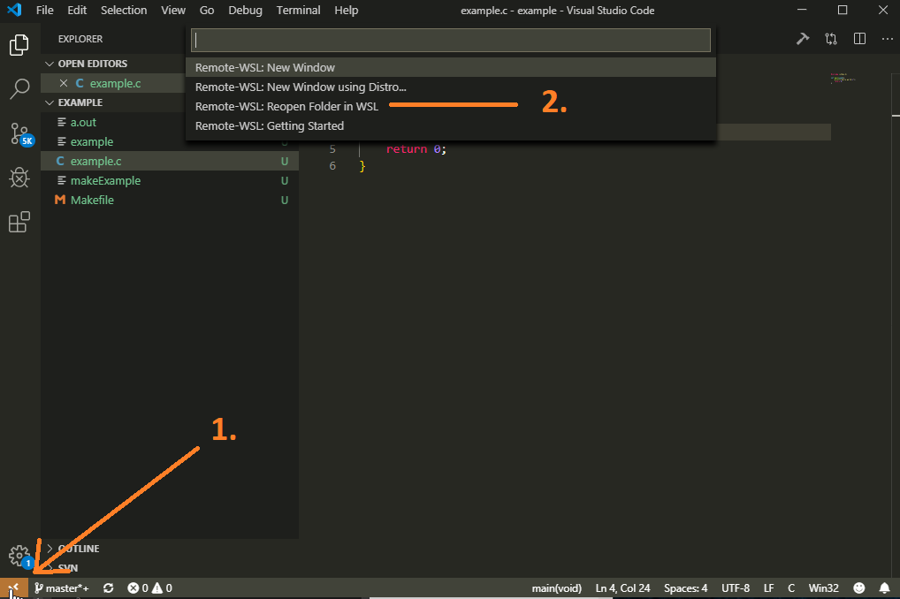

# Informatik 2 - Praktikum
## Ablauf
Wie aus dem Informatik 1 Praktikum bekannt:
Aufgaben aus dem Pool von Prof. Herold werden bearbeitet und im Praktikum abgenommen.

Die Vorgaben aus dem Informatik 1 Praktikum, wie:    
- die Überprüfung der Eingaben,
- Formatierung  
  
sind weiterhin gültig. 

Abgenommene Aufgaben werden auf dem Testatbogen abgezeichnet.  
**Sie sind für Ihren Testatbogen verantwortlich**


## Neuerungen zum WS 2019/20
### Speichern von Daten
Das Home-Laufwerk wird nicht mehr gesichert - nach dem Abmelden sind diese Daten weg!
Verwenden Sie den ADS1-Ordner in Ihrem Home-Verzeichnis.

### Nur Linux
Auf den Labor-PCs wird nurnoch Linux bereitgestellt.  
Die installierten C-"Entwicklungsumgebungen" sind:
- Visual Studio Code
- Geany
- emacs
- CodeBlocks
- Qt-Creator
  
Alle unter Anwendungen->Entwicklung zufinden.

#### Grundlegende Terminal-Befehle
- ls - list, zeigt die Dateien im aktuellen Ordner
- cd {Ziel} - change directory, wechselt in den Ziel-Ordner
  - ..   = übergeordneter Ordner
  -  .  = aktueller Ordner
  - ~ =  Home-Ordner
- mkdir {Name} - make directory, legt ein Verzeichnis an
- man {Befehl} - Hilfe Seite zum Befehl (ggf. auch {Befehl} --help)
- gcc - C-Compiler

### Visual Studio Code
Haben Sie in den Ziel ordner navigiert, können Sie mit "code ." den Ordner als Workspace öffnen.


### Make-System
``` Makefile
CC= gcc
CFLAGS= -Wall

helloworld:
	$(CC) example.c $(CFLAGS) -o makeExample
	
# wird zu: gcc example.c -Wall -o makeExample
```


Mehr zum Thema http://www.cs.colby.edu/maxwell/courses/tutorials/maketutor/


# Gleiche Entwicklungsbedungungen auf Windows
Wegen mehrerer Nachfragen, wie sie zuhause unter Windows in einer ähnlichen Umgebung programmieren können:
- Haben Sie Windows 10, können Sie das "Windows Subsystem for Linux" verwenden.
- Haben Sie kein Windows 10 oder wollen Sie "das komplette Linux-Erlebnis" müssen Sie eine Virtuelle Maschine verwenden.

## Windows Subsystem for Linux
In Windows 10 können Sie sich ein Linux als App aus dem Microsoft Store installieren und in VisualStudio Code verwenden.
[Hier](https://code.visualstudio.com/remote-tutorials/wsl/enable-wsl) finden Sie eine Schritt für Schritt Anleitung (von VisualStudio Code), wie Sie WSL-installieren können. Diese sollten sie bis Einschließlich "Install Linux" befolgen. Visual Studio Code installieren Sie ganz normal unter Windows.

Anschließend starten Sie VS Code, am Besten eine Ordner als workspace:


Installieren Sie das "Remote - WSL"-Extension:


Öffnen Sie Öffnen Sie den Ordner in als WSL-Remote neu:


Jetzt verwenden Sie VisualStudio Code mit Linux:


## Virtuelle Maschine
Im Internet finden Sie viele Anleitungen zum installieren von Linux als virtuelle Maschine, z.B. https://itsfoss.com/install-linux-in-virtualbox/

Abhängig von Ihrer gewählten Distribution finden Sie VS Code Installationsanleitungen bei [VsiualStudioCode](https://code.visualstudio.com/docs/setup/linux).